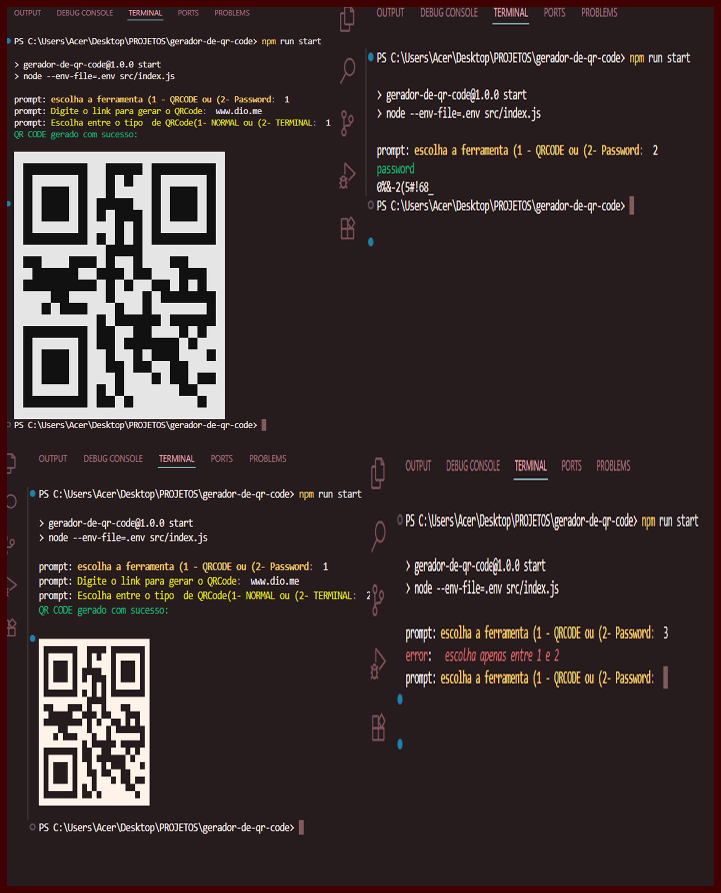

# Gerador de QR Code e Senha 🛠️🔒

Este projeto foi desenvolvido com **JavaScript** e **Node.js** e tem como objetivo gerar QR Codes e senhas seguras. Para criar os QR Codes, utilizamos a biblioteca `qrcode` do NPM, e para deixar o terminal mais divertido, usei a biblioteca `chalk` para colorir as letras no terminal.

## 🚀 Funcionalidades

- **Gerador de QR Code**: Gera QR Codes a partir de um texto ou URL.
- **Gerador de Senha**: Gera senhas aleatórias e seguras com letras, números e caracteres especiais.

## 📦 Tecnologias Utilizadas

- **Node.js**: Ambiente de execução para JavaScript no backend.
- **JavaScript**: Linguagem de programação principal.
- **npm**: Gerenciador de pacotes para instalar as dependências.
- **qrcode**: Biblioteca para gerar QR Codes.
- **chalk**: Biblioteca para colorir o texto no terminal.

--------------------------------------------------------------------------------------------------------------

## 🏃‍♂️ Como Usar

Após a instalação, você pode rodar o projeto diretamente no terminal.

### Gerar QR Code

1. Para gerar um QR Code, basta executar o seguinte comando:
  
    *npm run start*
    
    Você será solicitado a escolher entre **QR Code** ou **Senha**. Se escolher QR Code, insira o texto ou URL que deseja gerar.

### Gerar Senha

1. Para gerar uma senha segura, basta escolher a opção **Senha** ao executar o script. O gerador irá criar uma senha aleatória com letras, números e símbolos.

### Exemplo de Uso:

1. No terminal, após rodar *npm run start*, você verá:
   
    Escolha a ferramenta:
    1 - Gerar QR Code
    2 - Gerar Senha
    

2. Se escolher **2** para gerar a senha, o terminal exibirá uma senha segura colorida, graças ao `chalk`.

## 📸 Demonstração

### 📱 Gerando um QR Code:

$ npm run start
Escolha a ferramenta (1 - QR Code ou 2 - Senha): 1
Digite o texto ou URL para gerar o QR Code: https://www.exemplo.com
[QR Code gerado no terminal]

### 🔐 Gerando uma Senha:

$ npm run start
Escolha a ferramenta (1 - QR Code ou 2 - Senha): 2
Sua senha gerada: X!t8$8@Jr7

